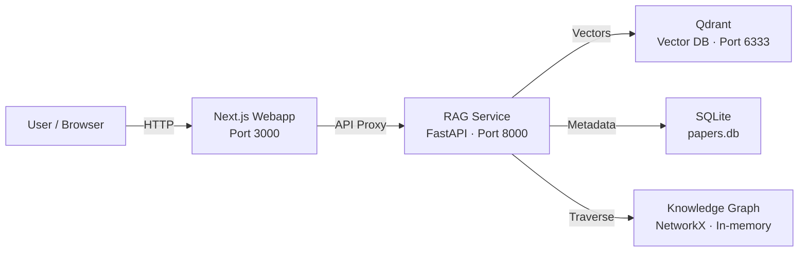
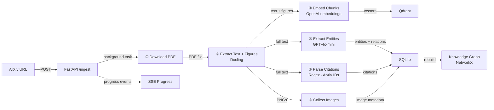
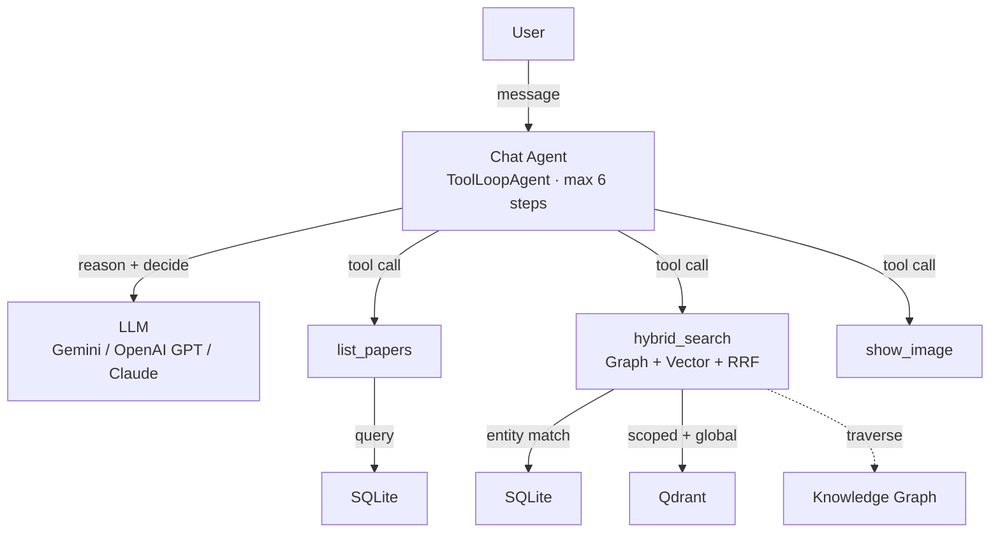
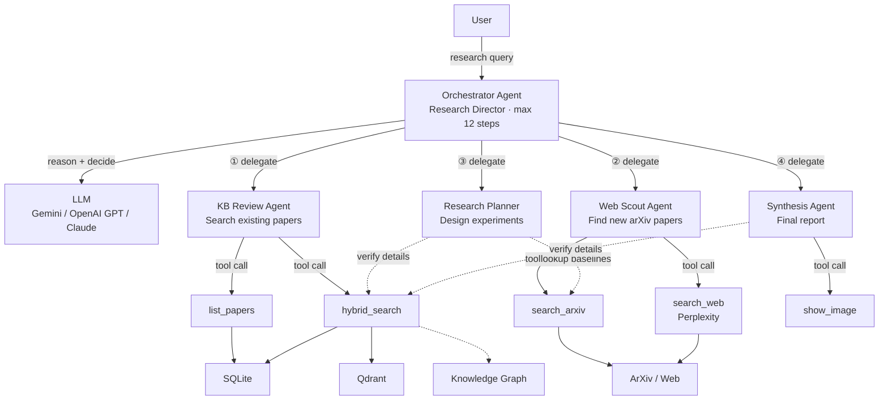
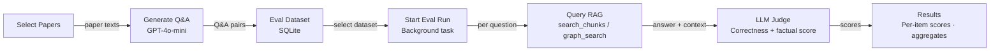

<p align="center">
  
</p>

<p align="center">
  
  
  
  
  
  
  
</p>

# Research Owl

An AI research assistant that reads academic papers, answers your questions, and conducts deep research with multiple specialized AI agents.

Give it a link to any academic paper — it reads, extracts key concepts, and remembers everything. Then ask questions and get cited, accurate answers, or let AI agents collaborate to produce deep research reports.

## Who Uses Research Owl?

- **PhD Students** — Quickly survey a new field, find related work, and identify research gaps for their thesis
- **Researchers** — Keep up with the latest papers, cross-reference findings, and plan new experiments
- **Research Teams** — Build a shared knowledge base of papers the team has read and query it together
- **ML Engineers** — Find SOTA baselines, compare methods, and discover which datasets to benchmark on

## Use Cases

- **Literature Review** — Survey a topic across all your papers
- **Paper Q&A** — Ask questions about specific papers and get cited answers
- **Experiment Planning** — Get baselines, datasets, and metrics from existing literature
- **Explore Connections** — Discover how papers and concepts link together
- **Deep Research** — AI agents collaborate to produce comprehensive research reports

## Architecture

### System Overview

High-level view of all services and how they connect.



### Ingestion Pipeline

Step-by-step flow of how an arxiv paper gets processed and stored.



#### Chunking Strategy

After Docling extracts markdown text from a PDF, the text is split into fixed-size overlapping chunks before embedding:

| Parameter | Value | Description |
|-----------|-------|-------------|
| **Chunk size** | 1 500 characters | Each chunk contains up to 1 500 characters of text |
| **Overlap** | 200 characters | Adjacent chunks share 200 characters to preserve context across boundaries |
| **Embedding model** | `text-embedding-3-small` | OpenAI embedding model (1 536 dimensions) |
| **Image chunks** | Separate | Figures are extracted as PNGs and embedded via a vision model description, stored alongside text chunks |

### Chat Flow

How a user chat message flows through the AI agent, tools, and retrieval backends.



### Research Multi-Agent System

Multi-agent system: an orchestrator delegates to specialized agents for literature review, web search, planning, and synthesis.



### Evaluation Pipeline

Dataset generation, evaluation runs, and LLM-as-judge scoring pipeline.



### Evaluation Results

We evaluate Research Owl using an **LLM-as-Judge** approach (not RAGAS). Q&A pairs are auto-generated from ingested papers, then the RAG pipeline answers each question. An LLM judge scores two metrics:

- **Factual Correctness** (0–1): How accurately does the RAG answer match the ground-truth answer?
- **Context Relevance** (0–1): How relevant is the retrieved context to the question?

We ran evaluation on two datasets across 4 ingested papers:

| Dataset | Papers | Questions | Factual Correctness | Context Relevance |
|---------|--------|-----------|---------------------|-------------------|
| `eval-test-set` | 1 | 10 | 0.73 | 0.95 |
| `eval-test-set-20` | 4 | 20 | 0.80 | 0.94 |

**Key takeaways:**
- Context relevance is consistently high (0.94–0.95), meaning the hybrid retrieval (graph + vector + RRF) finds the right passages
- Factual correctness improves with more papers in the knowledge base (0.73 → 0.80), likely because cross-paper context helps the LLM generate more complete answers
- The judge model (GPT-4o-mini) scores at temperature 0 for reproducibility

## Tech Stack

| Layer | Technologies |
|-------|-------------|
| **Frontend** | Next.js, React, Tailwind CSS, shadcn/ui |
| **AI Models** | Gemini, OpenAI GPT, Claude |
| **Search & Storage** | Qdrant vector DB, SQLite, NetworkX Knowledge Graph |
| **Backend** | FastAPI, Python, OpenAI embeddings |

## Getting Started

### Prerequisites

- [Docker](https://docs.docker.com/get-docker/) and Docker Compose
- An API key for at least one LLM provider (OpenAI, Google, or Anthropic)

### 1. Clone and configure

```bash
git clone https://github.com/hminle/research-owl.git
cd research-owl
cp .env.example .env
```

Edit `.env` and set your API key:

```bash
# Required: used by the RAG service for embeddings, entity extraction, and LLM calls
OWL_AI_GATEWAY_API_KEY=your-api-key
```

<details>
<summary>Optional environment variables</summary>

| Variable | Default | Description |
|----------|---------|-------------|
| `OWL_AI_GATEWAY_BASE_URL` | `https://ai-gateway.vercel.sh/v1` | OpenAI-compatible API base URL |
| `OWL_LLM_MODEL` | `openai/gpt-4o-mini` | Model for reasoning and generation |
| `OWL_VISION_MODEL` | `openai/gpt-4o` | Model for image/figure description |
| `OWL_EMBED_MODEL` | `openai/text-embedding-3-small` | Embedding model |
| `OWL_EMBED_DIMENSION` | `1536` | Embedding vector dimension |
| `AI_GATEWAY_API_KEY` | Falls back to `OWL_AI_GATEWAY_API_KEY` | Separate key for the webapp chat |

</details>

### 2. Run with Docker Compose

```bash
docker compose up
```

This starts three services:

| Service | URL | Description |
|---------|-----|-------------|
| **Webapp** | http://localhost:3000 | Next.js frontend |
| **RAG Service** | http://localhost:8000 | FastAPI backend |
| **Qdrant** | http://localhost:6333 | Vector database |

### 3. Local development (without Docker)

If you prefer to run services locally:

**Start Qdrant:**

```bash
docker run -d -p 6333:6333 -v qdrant_data:/qdrant/storage qdrant/qdrant:latest
```

**Start the RAG service:**

```bash
cd rag-service
pip install -e .
uvicorn research_owl.main:app --host 0.0.0.0 --port 8000 --reload
```

**Start the webapp:**

```bash
cd webapp
npm install
npm run dev
```

### 4. Use it

1. Open http://localhost:3000
2. Go to the **Ingest** page and paste an ArXiv URL (e.g. `https://arxiv.org/abs/2005.11401`)
3. Wait for the ingestion pipeline to finish (progress is streamed in real time)
4. Ask questions in the **Chat** page or run a **Deep Research** query

## Limitations

- **In-memory knowledge graph** — We use NetworkX as an in-memory graph rather than a dedicated graph database (e.g. Neo4j). The entire graph is rebuilt from SQLite on every restart, which becomes slow as the paper count grows
- **No chat persistence** — Chat and research conversations are not saved; refreshing the page or starting a new session loses all previous messages and context
- **ArXiv-only ingestion** — Only supports papers from ArXiv; other sources (Semantic Scholar, direct PDF uploads) are not yet supported
- **No authentication** — No user accounts or access control, so the app is not suitable for shared or public deployments without additional security
- **Fixed chunking** — Uses a simple character-based split (1 500 chars / 200 overlap) rather than section-aware or semantic chunking, which can cut mid-sentence or mid-paragraph

## Roadmap

- **Citation Chain Ingestion** — Automatically ingest referenced papers to build a deeper and interconnected knowledge base
- **Multi-User Collaboration** — Shared workspaces where teams can annotate, discuss, and query papers together
- **Fine-Tuned Embeddings** — Domain-specific embedding models trained on academic text for more accurate retrieval
- **Research Writing Assistant** — Draft paper sections with proper citations pulled directly from your knowledge base
