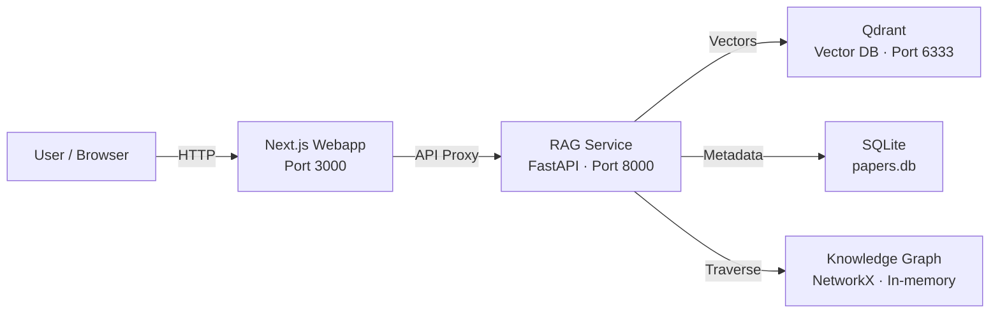
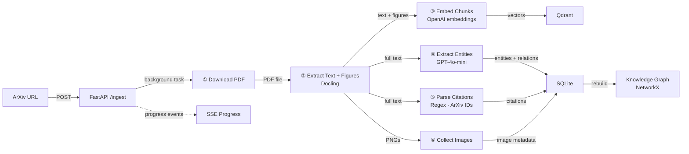
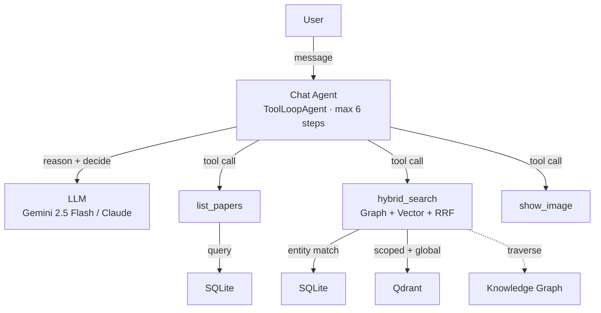
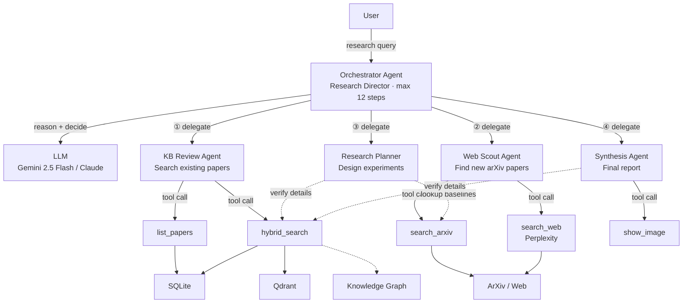
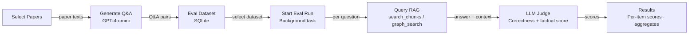

# Research Owl

An AI research assistant that reads academic papers, answers your questions, and conducts deep research with multiple specialized AI agents.

Give it a link to any academic paper — it reads, extracts key concepts, and remembers everything. Then ask questions and get cited, accurate answers, or let AI agents collaborate to produce deep research reports.

## Who Uses Research Owl?

- **PhD Students** — Quickly survey a new field, find related work, and identify research gaps for their thesis
- **Researchers** — Keep up with the latest papers, cross-reference findings, and plan new experiments
- **Research Teams** — Build a shared knowledge base of papers the team has read and query it together
- **ML Engineers** — Find SOTA baselines, compare methods, and discover which datasets to benchmark on

## Use Cases

- **Literature Review** — Survey a topic across all your papers
- **Paper Q&A** — Ask questions about specific papers and get cited answers
- **Experiment Planning** — Get baselines, datasets, and metrics from existing literature
- **Explore Connections** — Discover how papers and concepts link together
- **Deep Research** — AI agents collaborate to produce comprehensive research reports

## Architecture

### System Overview

High-level view of all services and how they connect.

### Ingestion Pipeline

Step-by-step flow of how an arxiv paper gets processed and stored.

### Chat Flow

How a user chat message flows through the AI agent, tools, and retrieval backends.

### Research Multi-Agent System

Multi-agent system: an orchestrator delegates to specialized agents for literature review, web search, planning, and synthesis.

### Evaluation Pipeline

Dataset generation, evaluation runs, and LLM-as-judge scoring pipeline.

## Tech Stack

| Layer | Technologies |
|-------|-------------|
| **Frontend** | Next.js, React, Tailwind CSS, shadcn/ui |
| **AI Models** | Gemini 2.5, Claude Haiku & Sonnet |
| **Search & Storage** | Qdrant vector DB, SQLite, NetworkX Knowledge Graph |
| **Backend** | FastAPI, Python, OpenAI embeddings |

## Roadmap

- **Citation Chain Ingestion** — Automatically ingest referenced papers to build a deeper and interconnected knowledge base
- **Multi-User Collaboration** — Shared workspaces where teams can annotate, discuss, and query papers together
- **Fine-Tuned Embeddings** — Domain-specific embedding models trained on academic text for more accurate retrieval
- **Research Writing Assistant** — Draft paper sections with proper citations pulled directly from your knowledge base
