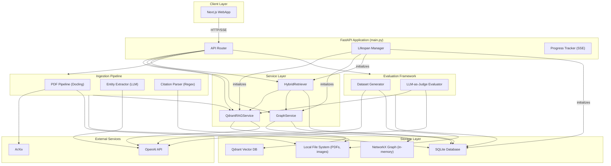

# RAG Service

Backend engine of Research Owl — ingests, indexes, and queries academic papers from ArXiv using vector search, knowledge graphs, and LLM-powered evaluation.

## Tech Stack

- **Runtime**: Python 3.11, FastAPI, Uvicorn
- **Vector DB**: Qdrant (cosine similarity, 1536-dim)
- **Graph**: NetworkX (in-memory directed graph)
- **Metadata DB**: SQLite3
- **PDF Processing**: Docling
- **LLM / Embeddings**: OpenAI (GPT-4o-mini, GPT-4o vision, text-embedding-3-small)

## Quick Start

```bash
pip install -e .
cp .env.example .env
docker compose up -d qdrant
python -m research_owl.main
# → http://localhost:8000
```

## Architecture



## Modules

| Module | Role |
|--------|------|
| `main.py` | HTTP routing, lifespan management, background task orchestration |
| `qdrant_service.py` | Embedding, vector storage, semantic search, LLM answer generation |
| `graph_service.py` | In-memory knowledge graph (papers, entities, citations) |
| `hybrid_retriever.py` | Combines graph entity matching with vector search via RRF |
| `ingestion/pipeline.py` | PDF download and text/image extraction via Docling |
| `ingestion/entity_extractor.py` | LLM-powered entity and relation extraction |
| `ingestion/citation_parser.py` | Regex-based ArXiv citation extraction |
| `evaluation/dataset_generator.py` | Q&A pair generation from paper text |
| `evaluation/evaluator.py` | LLM-as-judge scoring (correctness + factual accuracy) |
| `db.py` | SQLite schema and CRUD |
| `config.py` | Pydantic settings with `OWL_` env prefix |
| `progress.py` | In-memory step tracking with async SSE streaming |

## Design Decisions

1. **NetworkX over Neo4j**: In-memory graph simplifies deployment; sufficient for hundreds of papers.
2. **SQLite as source of truth**: NetworkX graph is rebuilt from SQLite on startup and after each ingestion.
3. **Hybrid Retrieval with RRF**: Graph-scoped + global vector search merged via Reciprocal Rank Fusion.
4. **Background tasks**: Long-running operations (ingestion, evaluation) use `asyncio.create_task()` with SSE progress streaming.
5. **LLM-as-Judge**: GPT-4o-mini judges both correctness (pass/fail) and factual accuracy (0-1 score).

## Configuration

All settings use the `OWL_` prefix via Pydantic `BaseSettings`.

| Variable | Default | Description |
|----------|---------|-------------|
| `OWL_AI_GATEWAY_API_KEY` | *(required)* | OpenAI API key |
| `OWL_AI_GATEWAY_BASE_URL` | `https://ai-gateway.vercel.sh/v1` | API base URL |
| `OWL_LLM_MODEL` | `openai/gpt-4o-mini` | Reasoning & generation model |
| `OWL_VISION_MODEL` | `openai/gpt-4o` | Image description model |
| `OWL_EMBED_MODEL` | `openai/text-embedding-3-small` | Embedding model |
| `OWL_EMBED_DIMENSION` | `1536` | Vector dimension |
| `OWL_QDRANT_URL` | `http://localhost:6333` | Qdrant server URL |
| `OWL_DATA_DIR` | `data/` | Root data directory |
| `OWL_IMAGES_SCALE` | `2.0` | PDF image extraction scale |

### Data Directory Structure

```
data/
├── owl.db              # SQLite database
├── pdfs/               # Downloaded PDFs
├── parsed/             # Docling-extracted markdown
└── images/             # Extracted figures and tables
```

### Docker Deployment

```bash
# Just Qdrant
docker compose up -d qdrant

# Full stack
docker compose up --build
```

```yaml
services:
  qdrant:
    image: qdrant/qdrant
    ports: ["6333:6333", "6334:6334"]
    volumes: [qdrant_data:/qdrant/storage]

  app:
    build: .
    ports: ["8000:8000"]
    env_file: .env
    depends_on: [qdrant]
    volumes: [./data:/app/data]
```
