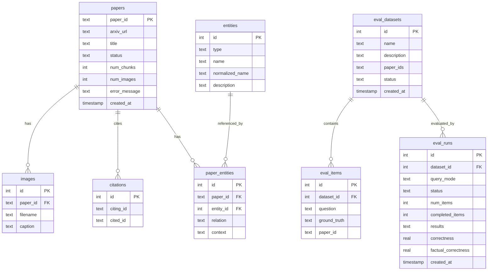

# Database Schema

## Overview

The RAG service uses three storage systems:

```mermaid
graph LR
    subgraph SQLite["SQLite (Metadata)"]
        papers
        images
        citations
        entities
        paper_entities
        eval_datasets
        eval_items
        eval_runs
    end

    subgraph Qdrant["Qdrant (Vectors)"]
        collection["research_owl collection<br/>1536-dim cosine"]
    end

    subgraph NetworkX["NetworkX (Graph)"]
        digraph["DiGraph<br/>(rebuilt from SQLite on startup)"]
    end

    SQLite -->|rebuild()| NetworkX
```

---

## SQLite Tables

### papers

Tracks ingested papers and their processing status.

| Column | Type | Description |
|--------|------|-------------|
| `paper_id` | TEXT PK | ArXiv ID (e.g., `2401.12345`) |
| `arxiv_url` | TEXT | Original ArXiv URL |
| `title` | TEXT | Paper title (extracted during ingestion) |
| `status` | TEXT | `pending` → `processing` → `completed` / `failed` |
| `num_chunks` | INTEGER | Number of text chunks indexed |
| `num_images` | INTEGER | Number of figures/tables extracted |
| `error_message` | TEXT | Error details if status = `failed` |
| `created_at` | TIMESTAMP | Ingestion start time |

### images

Figures and tables extracted from papers.

| Column | Type | Description |
|--------|------|-------------|
| `id` | INTEGER PK | Auto-increment |
| `paper_id` | TEXT FK | References `papers.paper_id` |
| `filename` | TEXT | Image filename (e.g., `fig_1.png`) |
| `caption` | TEXT | Figure/table caption |

### citations

Directed citation edges between papers.

| Column | Type | Description |
|--------|------|-------------|
| `id` | INTEGER PK | Auto-increment |
| `citing_id` | TEXT | ArXiv ID of the citing paper |
| `cited_id` | TEXT | ArXiv ID of the cited paper |

**Unique constraint**: `(citing_id, cited_id)`

### entities

Distinct entities extracted from papers (deduplicated by normalized name).

| Column | Type | Description |
|--------|------|-------------|
| `id` | INTEGER PK | Auto-increment |
| `type` | TEXT | `Method`, `Dataset`, `Metric`, `Model`, `Task` |
| `name` | TEXT | Display name |
| `normalized_name` | TEXT | Lowercase, punctuation-stripped, alias-mapped |
| `description` | TEXT | One-sentence description |

**Unique constraint**: `(type, normalized_name)`

### paper_entities

Many-to-many relationship between papers and entities with relation context.

| Column | Type | Description |
|--------|------|-------------|
| `id` | INTEGER PK | Auto-increment |
| `paper_id` | TEXT FK | References `papers.paper_id` |
| `entity_id` | INTEGER FK | References `entities.id` |
| `relation` | TEXT | `PROPOSES`, `USES`, `EVALUATES_ON`, `MEASURES`, `TRAINS`, `BENCHMARKS`, `ADDRESSES` |
| `context` | TEXT | Brief context string (< 100 chars) |

### eval_datasets

Evaluation dataset definitions.

| Column | Type | Description |
|--------|------|-------------|
| `id` | INTEGER PK | Auto-increment |
| `name` | TEXT | Dataset name |
| `description` | TEXT | Optional description |
| `paper_ids` | TEXT | JSON array of source paper IDs |
| `status` | TEXT | `generating`, `ready`, `failed` |
| `created_at` | TIMESTAMP | Creation time |

### eval_items

Individual Q&A pairs within datasets.

| Column | Type | Description |
|--------|------|-------------|
| `id` | INTEGER PK | Auto-increment |
| `dataset_id` | INTEGER FK | References `eval_datasets.id` |
| `question` | TEXT | Evaluation question |
| `ground_truth` | TEXT | Expected correct answer |
| `paper_id` | TEXT | Source paper for the question |

### eval_runs

Evaluation run results and aggregate metrics.

| Column | Type | Description |
|--------|------|-------------|
| `id` | INTEGER PK | Auto-increment |
| `dataset_id` | INTEGER FK | References `eval_datasets.id` |
| `query_mode` | TEXT | Mode used for querying (`semantic`, `paper:<id>`) |
| `status` | TEXT | `running`, `completed`, `failed` |
| `num_items` | INTEGER | Total items to evaluate |
| `completed_items` | INTEGER | Items evaluated so far |
| `results` | TEXT | JSON array of `EvalItemResult` objects |
| `correctness` | REAL | Aggregate pass rate (0.0–1.0) |
| `factual_correctness` | REAL | Mean factual score (0.0–1.0) |
| `created_at` | TIMESTAMP | Run start time |

---

## Entity-Relationship Diagram



---

## Qdrant Vector Collection

**Collection**: `research_owl`

| Property | Value |
|----------|-------|
| Distance | Cosine |
| Dimension | 1536 |
| Payload Indices | `paper_id` (keyword), `chunk_type` (keyword) |

### Point Schema

Each point in Qdrant represents a text chunk or image description:

```json
{
  "id": "uuid-v4",
  "vector": [0.012, -0.034, ...],  // 1536 floats
  "payload": {
    "paper_id": "2401.12345",
    "paper_title": "Paper Title",
    "chunk_type": "text",           // "text" or "image"
    "chunk_index": 0,
    "content": "The actual chunk text or image description...",
    "image_filename": null           // set for image chunks
  }
}
```

---

## NetworkX Graph Structure

The in-memory graph is a `networkx.DiGraph` rebuilt from SQLite on every startup and after each paper ingestion.

### Node Types

| Node ID Pattern | Attributes |
|----------------|------------|
| `paper:{arxiv_id}` | `kind="paper"`, `paper_id`, `title` |
| `{type}:{normalized_name}` | `kind="entity"`, `name`, `normalized_name`, `description` |

### Edge Types

| Source | Target | Relation |
|--------|--------|----------|
| Paper | Paper | `CITES` |
| Paper | Entity | `PROPOSES`, `USES`, `EVALUATES_ON`, `MEASURES`, `TRAINS`, `BENCHMARKS`, `ADDRESSES` |

The graph supports:
- Ego-graph extraction (N-hop neighborhood)
- Entity-to-paper traversal
