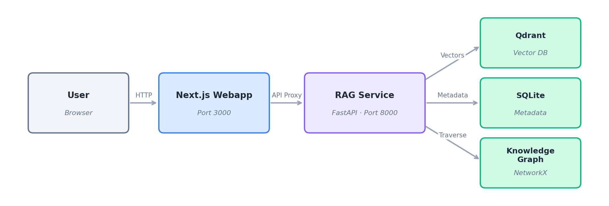
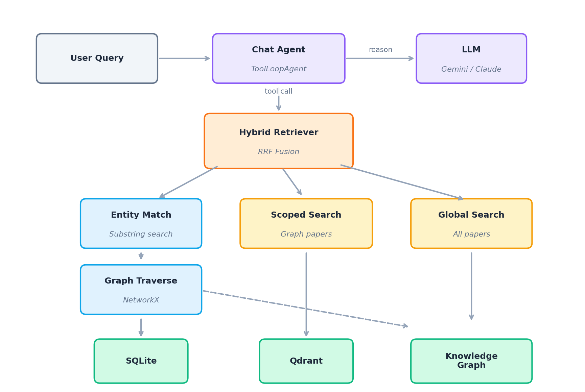
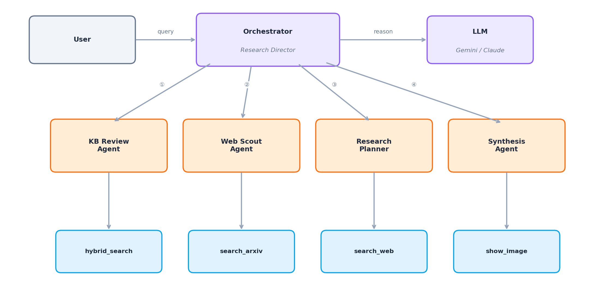

# Summary

Research Owl is an open-source AI research assistant that helps researchers
ingest, understand, and query academic papers. Given an arXiv URL, the system
downloads the PDF, extracts text and figures using document understanding
models, embeds content into a vector database, and builds a knowledge graph of
entities (methods, datasets, metrics, models, tasks) and citation
relationships. Researchers can then ask natural-language questions and receive
cited answers grounded in their paper collection, or launch multi-agent deep
research sessions where specialized AI agents collaborate to produce
comprehensive literature reviews and experiment plans.

# Statement of need

Researchers face an ever-growing volume of academic publications. Staying
current with relevant literature, identifying connections across papers, and
synthesizing findings from multiple sources are time-consuming tasks that
traditional tools address only partially. Reference managers like Zotero
[@Zotero:2024] organize bibliographic metadata but do not understand paper
content. General-purpose large language models (LLMs) can summarize text but
lack grounding in a researcher's specific paper collection and are prone to
hallucination.

Research Owl addresses this gap by combining retrieval-augmented generation
(RAG) [@Lewis:2020] with a domain-specific knowledge graph. The system targets
PhD students conducting literature reviews, research teams building shared
knowledge bases, and ML engineers comparing methods and baselines. By
extracting structured entities and citation networks from ingested papers,
Research Owl enables queries that require reasoning across multiple documents,
such as "which papers use dataset X with method Y?" or "what are the key
differences between approaches A and B?"

# State of the field

Several tools exist for AI-assisted research workflows. Semantic Scholar
[@Fricke:2018] provides a large-scale academic search engine with citation
analysis but does not support ingesting user-specified papers or building
personal knowledge bases. Elicit [@Elicit:2024] offers question-answering over
research papers but operates as a closed-source service without user control
over the underlying retrieval pipeline. ScholarAI and similar LLM plugins
provide paper search capabilities but lack persistent storage, knowledge graph
construction, and evaluation frameworks.

In the open-source space, general-purpose RAG frameworks such as LlamaIndex
[@LlamaIndex:2024] and LangChain [@LangChain:2024] provide building blocks for
retrieval-augmented generation but require significant custom development to
handle academic paper ingestion, entity extraction, and multi-agent research
workflows. PaperQA2 [@Skarlinski:2024] is an open-source tool for
question-answering over research papers that uses RAG with citation
verification, but it focuses on single-query answering rather than building a
persistent, queryable knowledge base with entity-level graph structure.

Research Owl was built as a standalone application rather than contributing to
existing frameworks for three reasons. First, the tight integration between the
knowledge graph and vector retrieval via Reciprocal Rank Fusion (RRF)
[@Cormack:2009] requires a unified architecture that is difficult to achieve as
a plugin for general-purpose RAG frameworks. Second, the multi-agent research
system with specialized agents (KB reviewer, web scout, research planner,
synthesis agent) is tailored specifically to the academic research workflow and
benefits from direct access to the knowledge graph. Third, the built-in
LLM-as-judge evaluation pipeline enables researchers to assess retrieval
quality on their own paper collections, which is not available in existing
tools.

# Software design

Research Owl follows a two-tier architecture with a Python backend (FastAPI)
and a JavaScript frontend (Next.js with React), as shown in
\autoref{fig:overview}.

**Ingestion pipeline.** When a user submits an arXiv URL, the backend executes
a six-step pipeline: (1) download the PDF, (2) extract text and figures using
Docling [@Docling:2024], (3) chunk text into overlapping segments and embed
them with OpenAI `text-embedding-3-small`, with figures described by a vision
model (GPT-4o) and also embedded, (4) extract structured entities (methods,
datasets, metrics, models, tasks) and their relationships using LLM-powered
structured output, (5) parse citation references from the full text, and
(6) collect image metadata. Progress is streamed to the frontend via
Server-Sent Events (SSE). The full pipeline is illustrated in
\autoref{fig:ingestion}.

**Hybrid retrieval.** The `HybridRetriever` combines two retrieval strategies.
First, it performs entity-based graph traversal: query terms are matched
against extracted entities via substring search, and the knowledge graph (built
with NetworkX [@Hagberg:2008]) is traversed to identify papers connected to
matching entities. Second, it performs cosine similarity search against the
Qdrant [@Qdrant:2024] vector database, both scoped to graph-discovered papers
and globally. Results from both strategies are merged using Reciprocal Rank
Fusion [@Cormack:2009], which assigns each chunk a score of $1/(k + r)$ where
$r$ is the rank in each result set and $k=60$ is a smoothing constant. This
hybrid approach surfaces results that are both semantically relevant and
structurally connected in the knowledge graph (\autoref{fig:retrieval}).

**Multi-agent research system.** For deep research queries, an orchestrator
agent delegates to four specialized sub-agents: a KB review agent that searches
existing ingested papers, a web scout agent that finds new papers on arXiv and
the web, a research planner that designs experiment proposals, and a synthesis
agent that produces the final report. Each agent has access to specific tools
(hybrid search, arXiv search, web search) and operates within a bounded tool
loop (maximum 6 steps for chat, 12 for research), as shown in
\autoref{fig:multiagent}.

**Evaluation pipeline.** Research Owl includes an LLM-as-judge evaluation
framework. Users generate question-answer pairs from ingested papers, then run
evaluation passes that query the RAG pipeline and score answers on two
dimensions: factual correctness (agreement with ground truth) and context
relevance (whether retrieved chunks contain sufficient information). Scores are
aggregated per run for tracking retrieval quality over time.

**Key design trade-offs.** We chose NetworkX for the knowledge graph over a
dedicated graph database (e.g., Neo4j) to minimize deployment complexity. The
graph is rebuilt from SQLite on startup, which is acceptable for collections of
hundreds of papers but would require a persistent graph store at larger scale.
Similarly, we use SQLite for metadata storage rather than PostgreSQL to keep
the system single-node deployable via Docker Compose with only Qdrant as an
external service.

# Research impact statement

Research Owl is a recently released open-source tool designed for immediate use
in academic research workflows. The system is deployed as a Docker
Compose application with minimal configuration, requiring only an API key for
LLM access. The complete source code, installation instructions, and
documentation are available in the project repository. The evaluation pipeline
provides reproducible benchmarking of retrieval quality, enabling researchers
to assess the system on their own paper collections before relying on it for
literature review tasks.

# AI usage disclosure

Generative AI tools (Claude Code by Anthropic) were used extensively during the
development of Research Owl for code generation, debugging, and iterative
refinement of the software architecture. All AI-generated code was reviewed,
tested, and validated by the author. This manuscript was drafted with AI
assistance and reviewed by the author for accuracy and completeness.

# Acknowledgements

We acknowledge the open-source communities behind Qdrant, Docling, NetworkX,
FastAPI, and Next.js, whose tools form the foundation of Research Owl.

# References
